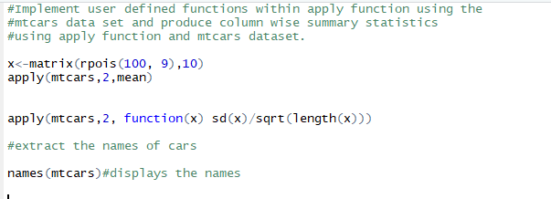
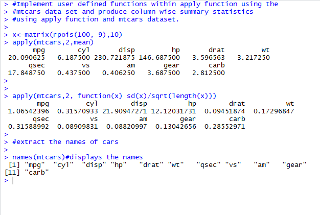

# Assignment-3.4
A. Implement user defined functions within apply function using the
mtcars data set and produce column wise summary statistics
using apply function and mtcars dataset.
B. write a program to extract the names of the list.

code:

Solution:

